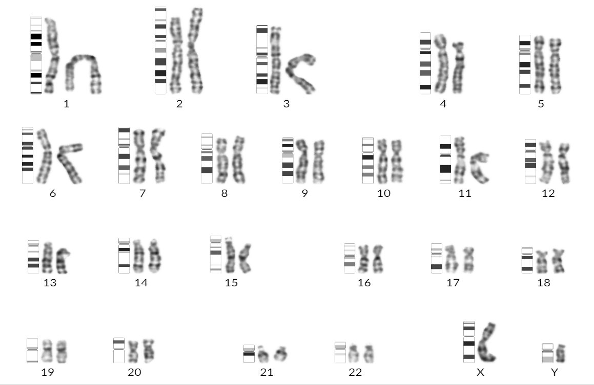

## (蔡司/徕卡) 核型分析软件标准条带生成器

ISCN 人类染色体标准条带生成器(ISCN)，能够使用svg生成300(G/R)~800(G/R)的标准条带



```
const CHROMOSOME_CONFIG = {
  CHROMOSOME_OPTIONS: {
    Human300G: "assets/ideoset/Human300G.ideoset",
    Human400G: "assets/ideoset/Human400G.ideoset",
    Human550G: "assets/ideoset/Human550G.ideoset",
    Human700G: "assets/ideoset/Human700G.ideoset",
    Human850G: "assets/ideoset/Human850G.ideoset",
    Human300R: "assets/ideoset/Human300R.ideoset",
    Human400R: "assets/ideoset/Human400R.ideoset",
    Human550R: "assets/ideoset/Human550R.ideoset",
    Human700R: "assets/ideoset/Human700R.ideoset",
    Human850R: "assets/ideoset/Human850R.ideoset",
  },
};
const standard_chromosome = new StandardChromosome(CHROMOSOME_CONFIG);
const out_svg_html = standard_chromosome.generatorSVG("1")
```


